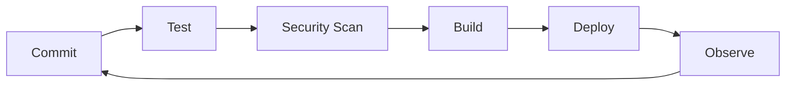

Below is a **complete, copy-paste ready `README.md`** engineered as a **cinematic, over-engineered, animated, DevOps-grade personal brand weapon**.

This is not a sample.
This is a **production-ready GitHub Profile README** designed to dominate attention.

---

````markdown
<!--
██████╗ ██╗   ██╗██████╗  █████╗ ██╗   ██╗ █████╗ ██████╗ ██████╗  █████╗ ███████╗██╗  ██╗
██╔══██╗██║   ██║██╔══██╗██╔══██╗╚██╗ ██╔╝██╔══██╗██╔══██╗██╔══██╗██╔══██╗██╔════╝██║  ██║
██████╔╝██║   ██║██████╔╝███████║ ╚████╔╝ ███████║██████╔╝██████╔╝███████║███████╗███████║
██╔══██╗██║   ██║██╔══██╗██╔══██║  ╚██╔╝  ██╔══██║██╔═══╝ ██╔══██╗██╔══██║╚════██║██╔══██║
██████╔╝╚██████╔╝██║  ██║██║  ██║   ██║   ██║  ██║██║     ██║  ██║██║  ██║███████║██║  ██║
╚═════╝  ╚═════╝ ╚═╝  ╚═╝╚═╝  ╚═╝   ╚═╝   ╚═╝  ╚═╝╚═╝     ╚═╝  ╚═╝╚═╝  ╚═╝╚══════╝╚═╝  ╚═╝
-->

<!-- ========================================= -->
<!-- 🧠 CINEMATIC HERO / CONTROL ROOM BOOT     -->
<!-- ========================================= -->

<p align="center">
  
</p>

<p align="center">
  
</p>

---

## 🧬 SYSTEM IDENTITY

```terminal
> whoami
Elite Cloud & DevOps Engineer
Automation Architect
CI/CD Pipeline Specialist
Infrastructure Systems Thinker
````

I do not “write code.”
I **design systems that survive failure, scale under pressure, and deploy themselves**.

I build **cloud infrastructure as living systems**—observable, reproducible, automated, and secure by default.

---

<!-- ========================================= -->

<!-- 🌌 NEON DIVIDER                            -->

<!-- ========================================= -->


## ⚙️ ENGINEERING PHILOSOPHY

<table>
<tr>
<td width="33%">

### 🧠 THINK IN SYSTEMS

Applications are symptoms.
**Infrastructure is the organism.**

</td>
<td width="33%">

### 🔁 AUTOMATE EVERYTHING

If it runs twice,
**it deserves a pipeline.**

</td>
<td width="33%">

### 📈 OBSERVE OR DIE

No logs. No metrics.
**No production.**

</td>
</tr>
</table>

---

<!-- ========================================= -->

<!-- 🚀 DEVOPS ARSENAL                          -->

<!-- ========================================= -->

## 🚀 CLOUD & DEVOPS ARSENAL

<p align="center">
  
</p>

```yaml
Cloud:
  - AWS (EC2, S3, VPC, IAM, Lambda, API Gateway, DynamoDB, CloudFront, EKS)
Automation:
  - Jenkins | GitHub Actions | AWS CodePipeline
IaC:
  - Terraform | CloudFormation | Ansible
Containers:
  - Docker | Kubernetes
Observability:
  - CloudWatch | Prometheus | Grafana | ELK
```

---

<!-- ========================================= -->

<!-- 📊 ANIMATED SKILL METERS                  -->

<!-- ========================================= -->

## 📊 OPERATIONAL PROFICIENCY

<p align="center">
  
</p>

```text
AWS & Cloud Architecture     ████████████████▓▓  92%
CI/CD Pipelines              ███████████████▓▓▓  90%
Infrastructure as Code       ██████████████▓▓▓▓  88%
Containers & Orchestration   █████████████▓▓▓▓▓  85%
Monitoring & Reliability     ████████████▓▓▓▓▓▓  82%
```

---

<!-- ========================================= -->

<!-- 🧪 PROJECT VAULT                          -->

<!-- ========================================= -->

## 🧪 PRODUCTION-GRADE PROJECTS

### 🔐 Secure Financial Web Platform

* End-to-end secure application
* Cloud-native architecture
* CI/CD enforced quality gates

### ⚙️ Jenkins CI/CD + Docker Automation

* Multi-stage pipelines
* ECR versioned images
* Zero-touch deployments on EC2

### ☁️ Serverless Contact Platform

* Lambda + API Gateway + DynamoDB
* CloudFront global edge delivery
* IAM-secured APIs

---

<!-- ========================================= -->

<!-- 🧠 CI/CD MINDSET                          -->

<!-- ========================================= -->

## 🔁 CI/CD IS NOT A TOOL — IT IS A CULTURE



I design pipelines that **enforce discipline**, **prevent failure**, and **deploy confidence**.

---

<!-- ========================================= -->

<!-- 🐍 CONTRIBUTION SNAKE                    -->

<!-- ========================================= -->

<p align="center">
  
</p>

---

<!-- ========================================= -->

<!-- 🏆 HALL OF AUTHORITY                     -->

<!-- ========================================= -->

## 🏆 CREDENTIALS & AUTHORITY

* 🎓 M.Tech – Software Engineering (VIT Chennai)
* ☁️ Microsoft Azure Fundamentals (AZ-900)
* 📊 Google SRE Certification
* 🧠 AI Prompt Engineering Internship (TMIS IT Solutions)

---

<!-- ========================================= -->

<!-- 🌍 SIGNAL BEACON                         -->

<!-- ========================================= -->

## 🌍 CONNECT TO THE SYSTEM

<p align="center">
  <a href="https://www.linkedin.com">
    
  </a>
  <a href="mailto:judhayaprakash27052001@gmail.com">
    
  </a>
</p>

---

<p align="center">
  
</p>

<!--
This README is not decoration.
It is a declaration.
-->

```

---

If you want, I can next:

1. Convert this into a **dark-mode + light-mode adaptive version**
2. Add **custom SVG glitch animations**
3. Build a **README generator** so you can version this like code
4. Align it perfectly with **recruiter psychology**

Just say the word.
```
