Here's a visually stunning, animated GitHub profile README with enhanced animations, icons, and design:

```markdown
<div align="center">

<!-- Animated Banner with Typing Effect -->


<!-- Animated GIF or Image -->


<!-- Profile Views Counter -->
<p align="center"> 
   
</p>

<!-- Social Links with Animated Icons -->
<div align="center">
  <a href="mailto:judhayaprakash27052001@gmail.com">
    
  </a>
  <a href="https://linkedin.com/in/your-profile">
    
  </a>
  <a href="https://github.com/Udhayaprakash-J">
    
  </a>
  <a href="https://your-portfolio.com">
    
  </a>
</div>

</div>

---

## 🎯 **About Me**

<p align="center">
  
</p>

I'm a passionate **DevOps & Cloud Engineer** with expertise in designing, automating, and securing scalable cloud infrastructure. I transform complex systems into efficient, reliable solutions using modern DevOps practices.

<div align="center">
  
**⚡ Quick Stats**
  
```text
🚀 Currently: Building Kubernetes Clusters on AWS EKS
📚 Learning: Advanced SRE & Cloud Security
🎯 Goal: Master Cloud-Native Technologies
💡 Passion: Infrastructure as Code & Automation
```

</div>

---

## 🛠 **Tech Stack**

### ☁️ **Cloud Platforms**
<p align="center">
  
  
  
</p>

### 🐳 **Containerization & Orchestration**
<p align="center">
  
  
  
</p>

### 🔄 **CI/CD & Automation**
<p align="center">
  
  
  
  
</p>

### 📊 **Monitoring & Observability**
<p align="center">
  
  
  
</p>

### 💻 **Programming & Scripting**
<p align="center">
  
  
  
  
</p>

### 🗄️ **Databases**
<p align="center">
  
  
</p>

---

## 🌟 **Featured Projects**

<div align="center">

### 📊 **Project Showcase**

| Project | Description | Tech Stack |
|---------|-------------|------------|
| **🔄 CI/CD Pipeline** | Automated Jenkins pipeline with Docker & AWS |    |
| **☁️ Serverless Contact Book** | Serverless web app on AWS |    |
| **🔒 Secure Financial App** | Loan processing interface with React |    |

</div>

<div align="center">

### 🚀 **Project Quick Links**
[](https://github.com/Udhayaprakash-J/jenkins-pipeline)
[](https://github.com/Udhayaprakash-J/serverless-contact-book)
[](https://github.com/Udhayaprakash-J/financial-web-app)

</div>

---

## 📈 **GitHub Analytics**

<div align="center">

<!-- GitHub Stats with Animated Theme -->
<a href="https://github.com/Udhayaprakash-J">
  
  
</a>

<!-- GitHub Streak Stats -->
[](https://git.io/streak-stats)

<!-- Activity Graph -->


</div>

---

## 📚 **Education & Certifications**

<div align="center">

### 🎓 **Education**
**Master in Software Engineering**  
🏫 *Vellore Institute of Technology, Chennai*  
📅 2019 - 2024 | 📊 CGPA: 7.69

### 📜 **Certifications**
<div align="center">
  
  
</div>

</div>

---

## 🏆 **DevOps Journey**

```mermaid
flowchart TD
    A[🏗 Infrastructure Setup] --> B[📦 Containerization]
    B --> C[🎯 Orchestration]
    C --> D[🔄 CI/CD Pipeline]
    D --> E[👁 Monitoring]
    E --> F[⚡ SRE Practices]
    F --> G[🔒 Cloud Security]
    G --> H[💰 Cost Optimization]
```



---

## 📞 **Let's Connect!**

<div align="center">

<!-- Animated Contact Cards -->
<div align="center">
  <a href="mailto:judhayaprakash27052001@gmail.com">
    
  </a>
  <a href="https://linkedin.com/in/your-profile">
    
  </a>
  <a href="https://github.com/Udhayaprakash-J">
    
  </a>
  <a href="https://your-portfolio.com">
    
  </a>
</div>

<!-- Animated Quote -->
<p align="center">
  
</p>

<!-- Visitor Counter with Animation -->
<p align="center">
  
</p>

<!-- Animated Footer -->
<p align="center">
  
  <strong>Thanks for visiting my profile!</strong>
  
</p>

</div>

---

<div align="center">

**⭐ Star my repositories if you find something interesting!**

[](https://star-history.com/#Udhayaprakash-J/Udhayaprakash-J&Date)

</div>
```

## ✨ **Features of This Design:**

1. **Animated Typing Text** - Welcome message types itself
2. **Animated Emojis** - Fluent animated emojis throughout
3. **Interactive Badges** - Colorful, animated badges for all technologies
4. **Project Showcase Table** - Organized project display
5. **Multiple Stats Widgets** - GitHub stats, streak, activity graph
6. **Flowchart Visualization** - DevOps journey using Mermaid.js
7. **Animated Contact Cards** - Interactive contact links
8. **Visitor Counter** - Real-time visitor tracking
9. **Star History Chart** - Shows repository growth
10. **Responsive Design** - Works on all devices

## 🚀 **To Make It Live:**

1. **Create a repository** named exactly as your GitHub username
2. **Copy this code** into a file named `README.md`
3. **Replace placeholders**:
   - `Udhayaprakash-J` with your actual GitHub username
   - `your-profile` with your LinkedIn username
   - `your-portfolio.com` with your portfolio URL
   - Update project repository links

4. **Add animated emojis** by:
   - Using more from [Animated Fluent Emojis](https://github.com/Tarikul-Islam-Anik/Animated-Fluent-Emojis)
   - Or custom GIFs in `assets/` folder

5. **Enable GitHub Pages** for your portfolio if you want to host it

This design will make your GitHub profile stand out with professional animations while maintaining a clean, organized layout that showcases your DevOps expertise!
