<div align="center">

<!-- Animated Banner with Multiple Emojis -->


<!-- Animated Emoji Carousel -->
<div align="center">
  
  
  
  
  
  
</div>

<!-- Animated Divider -->


<!-- Profile Views Counter with Emoji -->
<p align="center"> 
   
</p>

<!-- Social Links with Animated Emojis -->
<div align="center">
  <a href="mailto:judhayaprakash27052001@gmail.com">
    
  </a>
  <a href="https://linkedin.com/in/your-profile">
    
  </a>
  <a href="https://github.com/Udhayaprakash-J">
    
  </a>
  <a href="https://your-portfolio.com">
    
  </a>
</div>

</div>

---

## 🎯 **🌟 About Me 🌟**

<p align="center">
  
</p>

I'm a passionate **DevOps & Cloud Engineer** with expertise in designing, automating, and securing scalable cloud infrastructure. 🚀 I transform complex systems into efficient, reliable solutions using modern DevOps practices. 🎯

<div align="center">
  
**⚡ Quick Stats with Emojis ⚡**
  
```text
🚀 Currently: Building Kubernetes Clusters on AWS EKS
📚 Learning: Advanced SRE & Cloud Security
🎯 Goal: Master Cloud-Native Technologies
💡 Passion: Infrastructure as Code & Automation
🔥 Fun: Solving complex infrastructure puzzles
```
  


</div>

---

## 🛠️ **✨ Tech Stack ✨**

### ☁️ **Cloud Platforms** ☁️
<div align="center">
   
   
</div>

### 🐳 **Containerization & Orchestration** 🐳
<div align="center">
   
   
</div>

### 🔄 **CI/CD & Automation** 🔄
<div align="center">
   
   
</div>

### 📊 **Monitoring & Observability** 📊
<div align="center">
   
   
</div>

### 💻 **Programming & Scripting** 💻
<div align="center">
   
   
</div>

### 🔧 **Other Tools** 🔧
<div align="center">
   
  
   
  
</div>

---

## 🌟 **🎯 Featured Projects 🎯**

<div align="center">

<!-- Project Cards with Emojis -->
<table align="center">
  <tr>
    <td align="center">
      
      <br/>
      <strong>🔄 CI/CD Pipeline</strong>
      <br/>
      <em>Jenkins + Docker + AWS</em>
      <br/>
      <a href="https://github.com/Udhayaprakash-J/jenkins-pipeline">
        
      </a>
    </td>
    <td align="center">
      
      <br/>
      <strong>☁️ Serverless Contact Book</strong>
      <br/>
      <em>AWS Lambda + DynamoDB</em>
      <br/>
      <a href="https://github.com/Udhayaprakash-J/serverless-contact-book">
        
      </a>
    </td>
    <td align="center">
      
      <br/>
      <strong>💰 Secure Financial App</strong>
      <br/>
      <em>React + HTML/CSS</em>
      <br/>
      <a href="https://github.com/Udhayaprakash-J/financial-web-app">
        
      </a>
    </td>
  </tr>
</table>

</div>

---

## 📈 **📊 GitHub Analytics 📊**

<div align="center">

<!-- GitHub Stats with Emoji Background -->
<a href="https://github.com/Udhayaprakash-J">
  
  
</a>

<!-- GitHub Streak Stats with Emoji -->
<div align="center">
  
  [](https://git.io/streak-stats)
</div>

<!-- Activity Graph -->


<!-- Trophy Stats -->

<p align="center">  </p>

</div>

---

## 📚 **🎓 Education & Certifications 🎓**

<div align="center">

### 🎓 **Education**
 
**Master in Software Engineering**  
🏫 *Vellore Institute of Technology, Chennai*  
📅 2019 - 2024 | 📊 CGPA: 7.69

### 📜 **Certifications**
<div align="center">
   
   
</div>

</div>

---

## 🏆 **🚀 DevOps Journey 🚀**

```mermaid
flowchart TD
    A[🏗️ Infrastructure Setup] --> B[📦 Containerization]
    B --> C[☸️ Orchestration]
    C --> D[🔄 CI/CD Pipeline]
    D --> E[👁️ Monitoring]
    E --> F[⚡ SRE Practices]
    F --> G[🔒 Cloud Security]
    G --> H[💰 Cost Optimization]
    
    style A fill:#0D1117,stroke:#00FF00,stroke-width:2px
    style B fill:#0D1117,stroke:#00FF00,stroke-width:2px
    style C fill:#0D1117,stroke:#00FF00,stroke-width:2px
    style D fill:#0D1117,stroke:#00FF00,stroke-width:2px
    style E fill:#0D1117,stroke:#00FF00,stroke-width:2px
    style F fill:#0D1117,stroke:#00FF00,stroke-width:2px
    style G fill:#0D1117,stroke:#00FF00,stroke-width:2px
    style H fill:#0D1117,stroke:#00FF00,stroke-width:2px
```



---

## 💼 **✨ Experience ✨**

<div align="center">

### 🤖 **AI Prompt Intern – TMIS IT Solutions**
 
*Mar 2025*

Designed, tested, and refined text prompts to train AI-powered tools including virtual tutors, mentors, and conversational agents. Developed effective prompt strategies to improve model responses and enhance human-AI interaction.

</div>

---

## 📞 **🤝 Let's Connect! 🤝**

<div align="center">

<!-- Animated Contact Cards with Emojis -->
<table align="center">
  <tr>
    <td align="center">
      <a href="mailto:judhayaprakash27052001@gmail.com">
        
        <br/>
        <strong>Email</strong>
      </a>
    </td>
    <td align="center">
      <a href="https://linkedin.com/in/your-profile">
        
        <br/>
        <strong>LinkedIn</strong>
      </a>
    </td>
    <td align="center">
      <a href="https://github.com/Udhayaprakash-J">
        
        <br/>
        <strong>GitHub</strong>
      </a>
    </td>
    <td align="center">
      <a href="https://your-portfolio.com">
        
        <br/>
        <strong>Portfolio</strong>
      </a>
    </td>
  </tr>
</table>

<!-- Animated Quote with Emoji -->
<p align="center">
  
  
  
</p>

<!-- Visitor Counter with Animated Emoji -->
<div align="center">
  
  
  
</div>

<!-- Animated Footer with Multiple Emojis -->
<p align="center">
  
  <strong>Thanks for visiting my profile!</strong>
  
  <br/>
  
  
  
  
</p>

</div>

---

<div align="center">

**⭐ Star my repositories if you find something interesting! ⭐**

<!-- Star History with Emoji -->

[](https://star-history.com/#Udhayaprakash-J/Udhayaprakash-J&Date)

<!-- Animated Footer Line -->


<!-- Random Emoji Generator -->
<p align="center">
  
  <strong>Made with ❤️ & ☕ by Udhayaprakash J</strong>
  
</p>

</div>

<!-- Add some custom CSS for hover effects -->
<style>
  img:hover {
    transform: scale(1.1);
    transition: transform 0.3s ease;
  }
  a:hover {
    text-decoration: none;
  }
</style>
```

## 🎨 **Additional Emoji Categories You Can Add:**

If you want even more emojis, here are categories from the Animated Fluent Emojis repository:

```markdown
<!-- Technology Emojis -->


<!-- Celebration Emojis -->


<!-- Nature Emojis -->


<!-- Tool Emojis -->


```
